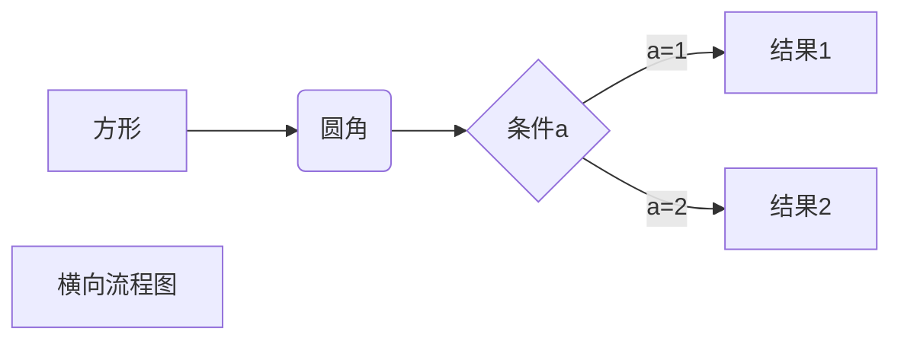

# vue-interview

## v-if和v-for谁的优先级更高，应该如何使用避免性能问题
- 同级情况下
```html
<div v-for="child in children" v-for="isFile">{{ child.file }}</div>
```

```javascript
//打印render函数
// 先执行v-for循环,再执行v-if
ƒ anonymous(
) {
with(this){return _c('div',{attrs:{"id":"app"}},_l((children),function(child){return (isFile)?_c('div',[_v(_s(child.file))]):_e()}),0)}
}
```

- 不同级情况下
```html
<template v-if="isFile">
    <div v-for="child in children">{{ child.file }}</div>
</template>
```

```javascript
// 打印render函数
// 先执行v-if,再执行v-for循环
ƒ anonymous(
) {
with(this){return _c('div',{attrs:{"id":"app"}},[(isFile)?_l((children),function(child){return _c('div',[_v(_s(child.file))])}):_e()],2)}
}
```

